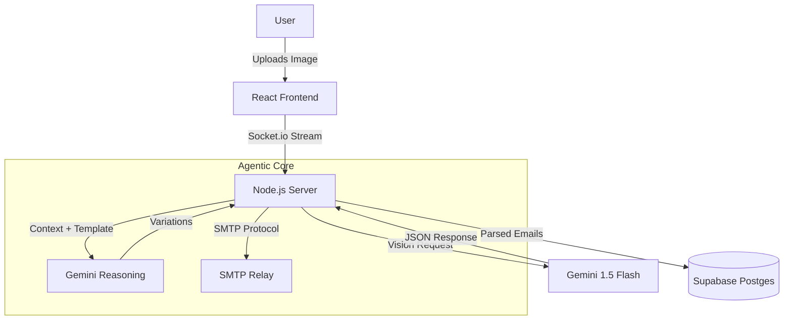

# BLASTR - The Agentic Email Orchestrator 🚀


> **Submission for the Google Gemini API Hackathon**

BLASTR  is a high-performance, agentic email marketing engine built to revolutionize outreach. By leveraging **Gemini 3.0 Flash**, BLASTR transforms static email lists into dynamic, hyper-personalized conversations at scale.

## 🧠 Powered by Gemini 3.0 Flash

BLASTR is not just a wrapper; it's deeply integrated with the Gemini ecosystem to power every stage of the campaign lifecycle:

### 1. Vision-Powered List Extraction 👁️
**API Used:** `gemini-1.5-flash` (Vision capabilities)
- **Feature:** Upload screenshots of Excel sheets, Twitter/X bio lists, or raw text images.
- **Gemini's Role:** Instantly parses complex visual data into structured JSON email lists, handling OCR errors and formatting automatically.
- **Benefit:** Eliminates manual data entry. "See it, Blast it."

### 2. Hyper-Personalized Composition ✍️
**API Used:** `gemini-1.5-flash` (Text Generation)
- **Feature:** "Agent Composer" creates unique email variations for *each* recipient.
- **Gemini's Role:** Analyzes the recipient's metadata (Company, Role, Name) to rewrite the core message 3 different ways (Professional, Casual, Direct), distinct semantic variations, not just mad-libs.
- **Benefit:** Bypasses spam filters and increases engagement by treating every lead as a unique individual.

### 3. Deliverability & Spam Guard 🛡️
**API Used:** `gemini-1.5-flash` (Reasoning & Analysis)
- **Feature:** Pre-flight Risk Analysis.
- **Gemini's Role:** acting as a rigorous SMTP server admin, Gemini scores your draft from 0-10 on spam likelihood, flagging trigger words (e.g., "FREE", "Urgent") and suggesting safer synonyms.
- **Benefit:** Protects your domain reputation before a single email is sent.

### 4. Real-Time Streaming Interface ⚡
**API Used:** `generateContentStream`
- **Feature:** Live AI drafting.
- **Gemini's Role:** Streams tokens in real-time to the frontend, providing a responsive "ghost-writer" experience that feels instant.

---

## 🏗️ Architecture



## 💻 Code Implementation

BLASTR utilizes the `GoogleGenAI` SDK for robust streaming and multimodal interactions:

```typescript
// Streaming content for real-time drafting
async *generateContentStream(prompt: string, options: any = {}) {
    const ai = this.getCurrentClient();
    const stream = await ai.models.generateContentStream({
        model: GEMINI_MODELS.FLASH_1_5,
        contents: this.formatContents(prompt),
        config: { temperature: 0.7 }
    });

    for await (const chunk of stream.stream) {
        if (chunk.text()) yield chunk.text();
    }
}
```

## 🚀 Getting Started

### Prerequisites
- Node.js v18+
- A Google Gemini API Key

### Installation

1. **Clone the repository**
   ```bash
   git clone https://github.com/David-patrick-chuks/blastr.git
   cd blastr
   ```

2. **Backend Setup**
   ```bash
   cd backend
   npm install
   cp .env.example .env
   # Add your GEMINI_API_KEY in .env
   npm run dev
   ```

3. **Frontend Setup**
   ```bash
   cd web
   npm install
   npm run dev
   ```

4. **Navigate to `http://localhost:5173`**

## 🔮 Future Roadmap

- **Gemini 2.0 Pro Integration:** For complex multi-turn negotiation agents.
- **Audio Mode:** Voice-command campaign management using multimodal audio inputs.
- **Video Personalization:** Generating personalized video intros using Gemini's future video generation capabilities.

---

*Built with ❤️ by David-patrick-chuks for the Gemini Hackathon.*
